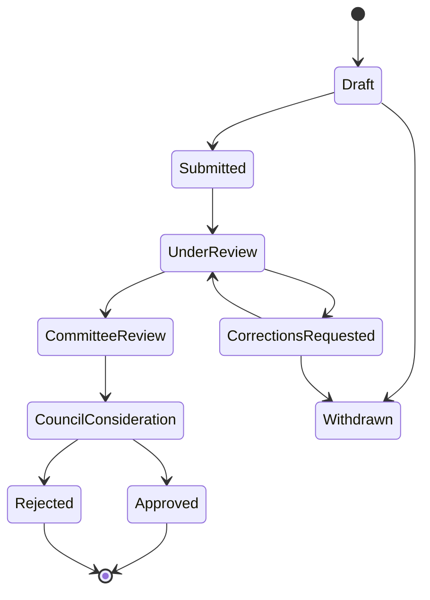

# NIMENA Member Services: Phase 1 Blueprint

## Outcome

Create one authoritative member record that carries a person from application through review, approval, renewal and continuing professional development, while giving the secretariat a clear operational queue and audit history.

The current build is a front-end prototype. It is safe for review because it uses fictional records, does not authenticate real people, does not accept payments and does not transmit selected documents.

## Roles

| Role | Primary capabilities |
| --- | --- |
| Applicant | Start an application, save a draft, upload required evidence, submit, answer correction requests and track status |
| Member | Maintain approved profile, renew membership, download receipts/certificates, record CPD and register for events |
| Membership officer | Triage applications, verify documents, request corrections, record notes and prepare a recommendation |
| Committee reviewer | Review complete applications and record the Membership Committee decision |
| Council approver | Record Council consideration and the final approval or rejection |
| Finance officer | Reconcile invoices/payments, issue receipts and review renewal exceptions |
| System administrator | Manage roles, grades, chapters, fee rules, templates and audit access without silently changing decisions |

Staff accounts should use least privilege. A staff member must not gain a broader role merely by changing a URL or client-side control.

## Membership workflow

Every transition records who acted, the previous and new state, a timestamp and an optional reason. Corrections create a new application version while preserving the submitted version that was reviewed.

## Application information

The existing NIMENA form maps into these records:

| Record | Information |
| --- | --- |
| Application | Reference, grade, chapter, state, assignee, version and submission dates |
| Applicant profile | Name, permanent address, email, telephone, date of birth, sex and nationality |
| Engineering registration | COREN or other council, registration number and evidence |
| Professional memberships | Body, membership type, number and effective date |
| Qualifications | Institution, qualification, course and award year |
| Employment | Employer, position/rank, projects and dates |
| Documents | Purpose, private storage key, checksum, type, size and verification state |
| Declaration | Text/version accepted, authenticated actor, timestamp and originating application version |
| Review | Stage, checklist, recommendation, reviewer, notes and decision date |

Corporate Firm applications require an organization record and an authorized representative; they should not be forced into an individual member profile.

## Phase 1 surfaces

### Applicant and member

- Guided membership application with grade-specific evidence requirements
- Draft saving, submission receipt and visible status history
- Correction request and resubmission
- Member dashboard and digital membership card after approval
- Renewal invoice, payment state and downloadable receipt
- Private document/certificate library
- CPD record and event registration history
- Profile and communication preferences

### Secretariat

- Searchable application queue with age, completeness, grade, chapter and assignee
- Structured document verification and review checklist
- Internal notes separated from applicant-visible messages
- Correction request templates and response history
- Committee and Council decision recording
- Membership-number issuance after approval
- Renewal/payment exception queues and basic exports
- Append-only activity/audit timeline

## Recommended production architecture

| Layer | Recommendation | Reason |
| --- | --- | --- |
| Web application | Next.js App Router + TypeScript | One responsive codebase for public, member and staff experiences; server-rendered protected routes |
| Database | PostgreSQL | Strong relational model, transactions, reporting and auditable constraints |
| Authentication | Managed identity provider; verified email and MFA for staff | Avoid building password storage and recovery in-house |
| Authorization | Server-side role and record checks | UI hiding is not security; every query and mutation needs authorization |
| Files | Private S3-compatible object storage with signed access | Keeps evidence non-public and access time-limited |
| Payments | Nigerian payment provider through server-created checkout and verified webhooks | Prevents trusting browser callbacks; supports reconciliation |
| Notifications | Transactional email first, optional SMS/WhatsApp after policy approval | Traceable application and renewal communication |
| Operations | Error monitoring, structured logs, backups and uptime checks | Makes failures diagnosable and recoverable |

The public GitHub Pages website may continue to host institutional content. The portal should run as a separate application—ideally `members.nimena.org.ng`—and link back to the public site.

## Security and privacy baseline

- Never put submitted certificates or identity documents in a public repository or public bucket.
- Encrypt transport and provider-managed storage; never log uploaded document content or passwords.
- Permit applicants to see only their own records; staff access must be purpose- and role-bound.
- Require MFA for staff and protect authentication, password reset and payment endpoints with rate limits.
- Validate file type by content, cap sizes, scan uploads and serve them with forced private access.
- Use server-verified payment webhooks with idempotency keys; the browser cannot mark an invoice paid.
- Maintain append-only audit events for review, approval, fee and role changes.
- Define retention and deletion rules before collecting real personal data.
- Back up the database, test restoration and document incident handling.

## Decisions NIMENA must confirm

| Decision | Why it blocks production |
| --- | --- |
| Eligibility for each membership grade | Determines questions, evidence and review rules |
| Application, admission and annual fees | Determines invoices, timing and renewal logic |
| Required documents per grade | Determines validation and completeness |
| Chapter list and assignment rules | Current form names only Lagos and Eastern |
| Committee/Council decision authority | Determines roles, quorum and valid transitions |
| Membership number format | Must be unique, stable and migration-compatible |
| Renewal period, grace period and arrears rules | Determines membership standing and reminders |
| Existing-register data quality and migration owner | Prevents duplicate or incorrect member records |
| Public-directory opt-in fields | Protects member privacy while supporting verification |
| Data retention and privacy contact | Required before collecting real applications |

## Phase 1 acceptance criteria

Phase 1 is ready for controlled production only when:

1. An applicant can register, verify an email, save, submit and track one application.
2. Required fields/documents change correctly by grade and are validated on the server.
3. Staff can process the full approved workflow without editing database records manually.
4. Every decision and status transition appears in the audit history.
5. Payment status changes only from a verified provider event or an authorized, audited reconciliation.
6. Approved applicants receive a unique member number and member workspace.
7. Permissions have automated tests for applicant, member and each staff role.
8. Mobile layouts, keyboard navigation, screen-reader labels and error states are tested.
9. Backups, restoration, privacy, retention and incident procedures are documented and tested.
